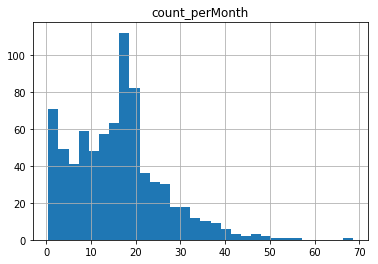
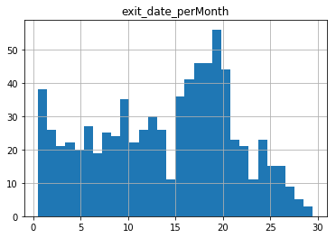

```python
import pandas as pd
import numpy as np

import datetime
import calendar

import matplotlib.pyplot as plt
from IPython.display import display
```


```python
## parameters

end_time = datetime.datetime(2019, 3, 1, 0, 0)  # use transactions from the starting date to the end of 2/28/2019

## downtown data 
# s extract --garages 571548 --start-time 2019-01-01 --end


## Load and modify the data

df = pd.read_csv('transactions.csv')
df['exitTime'] = pd.to_datetime(df['exit_time'])
df['entryTime'] = pd.to_datetime(df['entry_time'])
df = df.loc[(df['exitTime'] < end_time) & (df['user_type'] != 'Transient')] # only Contract parking before certain time

df2 = df[['card_number','entryTime','exitTime','user_type']]

df2['exit_date'] = [x.date() for x in df2['exitTime']]
df2['ent_date'] = [x.date() for x in df2['entryTime']]
monthOnly = [x.month for x in df2['exit_date']]
weekNo = [x.weekday() for x in df2['exit_date']]
df2['month'] = monthOnly
df2['dow'] = weekNo

df2.loc[df2['user_type'] == 'ZIPCAR', 'user_type'] = 'ZIP CAR' # clean acount names

```

    /Users/yq/anaconda2/envs/py3/lib/python3.6/site-packages/ipykernel_launcher.py:18: SettingWithCopyWarning: 
    A value is trying to be set on a copy of a slice from a DataFrame.
    Try using .loc[row_indexer,col_indexer] = value instead
    
    See the caveats in the documentation: http://pandas.pydata.org/pandas-docs/stable/indexing.html#indexing-view-versus-copy
    /Users/yq/anaconda2/envs/py3/lib/python3.6/site-packages/ipykernel_launcher.py:19: SettingWithCopyWarning: 
    A value is trying to be set on a copy of a slice from a DataFrame.
    Try using .loc[row_indexer,col_indexer] = value instead
    
    See the caveats in the documentation: http://pandas.pydata.org/pandas-docs/stable/indexing.html#indexing-view-versus-copy
    /Users/yq/anaconda2/envs/py3/lib/python3.6/site-packages/ipykernel_launcher.py:22: SettingWithCopyWarning: 
    A value is trying to be set on a copy of a slice from a DataFrame.
    Try using .loc[row_indexer,col_indexer] = value instead
    
    See the caveats in the documentation: http://pandas.pydata.org/pandas-docs/stable/indexing.html#indexing-view-versus-copy
    /Users/yq/anaconda2/envs/py3/lib/python3.6/site-packages/ipykernel_launcher.py:23: SettingWithCopyWarning: 
    A value is trying to be set on a copy of a slice from a DataFrame.
    Try using .loc[row_indexer,col_indexer] = value instead
    
    See the caveats in the documentation: http://pandas.pydata.org/pandas-docs/stable/indexing.html#indexing-view-versus-copy
    /Users/yq/anaconda2/envs/py3/lib/python3.6/site-packages/pandas/core/indexing.py:543: SettingWithCopyWarning: 
    A value is trying to be set on a copy of a slice from a DataFrame.
    Try using .loc[row_indexer,col_indexer] = value instead
    
    See the caveats in the documentation: http://pandas.pydata.org/pandas-docs/stable/indexing.html#indexing-view-versus-copy
      self.obj[item] = s


```python
## How many unique cards made transactions each month for each account

uniqCard = df2.groupby(['user_type','month'])['card_number'].nunique()
print(uniqCard)
uniqCard.to_csv('uniqueCard.csv')
```

    user_type                         month
    ALOFT                             1          3
                                      2          2
    ARCHDIOCESE                       1          2
                                      2          2
    CITY CLUB APARTMENTS              1        313
                                      2        293
    DIAMOND COLLATERAL                1          4
                                      2          2
    DUGGAN FOR DETROIT                1          2
                                      2          2
    ELEMENT HOTEL EMPLOYEE            2          1
    ELEMENT HOTEL VALET               1          7
                                      2         11
    FOUNDATION HOTEL                  1          9
                                      2          7
    GENERAL PUBLIC                    1         10
                                      2          9
    HOLIDAY INN EXPRESS               2         15
    LINKED IN                         1         49
                                      2         45
    MERIDIAN HEALTH PLAN              1        282
                                      2        245
    METROPOLITAN BUILDING MANAGEMENT  1          9
                                      2          7
    Monthly                           1         12
                                      2          2
    PARK RITE INC                     1          3
                                      2          2
    PARK-RITE INC                     1         31
                                      2         31
    PROFESSIONAL VALET                1          1
                                      2          1
    SIMPLY TECHNOLOGY                 1          1
                                      2          1
    SIMPLY tECHNOLOGY                 1          1
                                      2          1
    ST ALS                            1          5
                                      2          5
    ZIP CAR                           1          2
                                      2          3
    Name: card_number, dtype: int64


```python
## How many transactions each cards made each month by account

transPerCard = df2.groupby(['user_type','month']).card_number.value_counts().reset_index(name='count')
print(transPerCard)
transPerCard.to_csv('transPerCard.csv')
```

                     user_type  month card_number  count
    0                    ALOFT      1   183:43679     24
    1                    ALOFT      1   183:43681     17
    2                    ALOFT      1   183:43680      1
    3                    ALOFT      2   183:43679     21
    4                    ALOFT      2   183:43681      3
    5              ARCHDIOCESE      1   183:43602     12
    6              ARCHDIOCESE      1   183:43601     10
    7              ARCHDIOCESE      2   183:43601     11
    8              ARCHDIOCESE      2   183:43602     10
    9     CITY CLUB APARTMENTS      1     45:5022     88
    10    CITY CLUB APARTMENTS      1     45:5061     64
    11    CITY CLUB APARTMENTS      1     45:5197     58
    12    CITY CLUB APARTMENTS      1     45:5372     53
    13    CITY CLUB APARTMENTS      1     45:5077     51
    14    CITY CLUB APARTMENTS      1     45:5152     51
    15    CITY CLUB APARTMENTS      1     45:5124     50
    16    CITY CLUB APARTMENTS      1     45:5327     47
    17    CITY CLUB APARTMENTS      1     45:5033     45
    18    CITY CLUB APARTMENTS      1     45:5229     45
    19    CITY CLUB APARTMENTS      1     45:5367     45
    20    CITY CLUB APARTMENTS      1     45:5160     44
    21    CITY CLUB APARTMENTS      1     45:5244     43
    22    CITY CLUB APARTMENTS      1     45:5300     43
    23    CITY CLUB APARTMENTS      1     45:5038     42
    24    CITY CLUB APARTMENTS      1     45:5370     41
    25    CITY CLUB APARTMENTS      1     45:5024     40
    26    CITY CLUB APARTMENTS      1     45:5314     40
    27    CITY CLUB APARTMENTS      1     45:5025     39
    28    CITY CLUB APARTMENTS      1     45:5076     39
    29    CITY CLUB APARTMENTS      1     45:5122     38
    ...                    ...    ...         ...    ...
    1403         PARK-RITE INC      2   183:43651      2
    1404         PARK-RITE INC      2   183:43654      2
    1405         PARK-RITE INC      2   183:43633      1
    1406         PARK-RITE INC      2   183:43635      1
    1407         PARK-RITE INC      2   183:43641      1
    1408         PARK-RITE INC      2   183:43646      1
    1409         PARK-RITE INC      2   183:43647      1
    1410         PARK-RITE INC      2   183:43648      1
    1411         PARK-RITE INC      2   183:43693      1
    1412    PROFESSIONAL VALET      1   183:43694      1
    1413    PROFESSIONAL VALET      2   183:43694      1
    1414     SIMPLY TECHNOLOGY      1   183:43689      3
    1415     SIMPLY TECHNOLOGY      2   183:43689      2
    1416     SIMPLY tECHNOLOGY      1   183:43690      3
    1417     SIMPLY tECHNOLOGY      2   183:43690      3
    1418                ST ALS      1   183:43669     26
    1419                ST ALS      1   183:43667     17
    1420                ST ALS      1   183:43671     16
    1421                ST ALS      1   183:43670     15
    1422                ST ALS      1   183:43668      8
    1423                ST ALS      2   183:43669     21
    1424                ST ALS      2   183:43667     19
    1425                ST ALS      2   183:43670     19
    1426                ST ALS      2   183:43671     19
    1427                ST ALS      2   183:43668      6
    1428               ZIP CAR      1   183:43631     33
    1429               ZIP CAR      1   183:43630     29
    1430               ZIP CAR      2   183:43631     38
    1431               ZIP CAR      2    183:5125     19
    1432               ZIP CAR      2   183:43630      5
    
    [1433 rows x 4 columns]


```python
## How many transactions each cards made per month
uses = df2.groupby(['card_number']).size().reset_index(name='count').sort_values(['count'],ascending=False)
uses['count_perMonth'] = uses['count']/2
uses.hist(column='count_perMonth',bins = 30)

```


    array([[<matplotlib.axes._subplots.AxesSubplot object at 0x119688c18>]],
          dtype=object)





```python
## How many days each card was used per month

uses2 = df2.groupby('card_number').agg({'exit_date': 'nunique'}).sort_values('exit_date',ascending=False)
uses2['exit_date_perMonth'] = uses2['exit_date']/2
uses2.hist(column='exit_date_perMonth',bins = 30)
#uses2.to_csv('usesByCard2.csv')
```


    array([[<matplotlib.axes._subplots.AxesSubplot object at 0x116c82fd0>]],
          dtype=object)





```python
# Cards with more than one entries within one day

use_daily = df2.groupby(['card_number','exit_date'])['exit_date'].size().reset_index(name='count')
use_daily.to_csv('dailyUse.csv')
use_daily_multi = use_daily.loc[use_daily['count'] > 1]
use_daily_multi
#use_daily_multi.to_csv('dailyUse_mul.csv')
```


<div>
<style scoped>
    .dataframe tbody tr th:only-of-type {
        vertical-align: middle;
    }

    .dataframe tbody tr th {
        vertical-align: top;
    }

    .dataframe thead th {
        text-align: right;
    }
</style>
<table border="1" class="dataframe">
  <thead>
    <tr style="text-align: right;">
      <th></th>
      <th>card_number</th>
      <th>exit_date</th>
      <th>count</th>
    </tr>
  </thead>
  <tbody>
    <tr>
      <th>34</th>
      <td>183:43602</td>
      <td>2019-02-05</td>
      <td>2</td>
    </tr>
    <tr>
      <th>99</th>
      <td>183:43613</td>
      <td>2019-01-19</td>
      <td>2</td>
    </tr>
    <tr>
      <th>129</th>
      <td>183:43615</td>
      <td>2019-01-01</td>
      <td>2</td>
    </tr>
    <tr>
      <th>131</th>
      <td>183:43615</td>
      <td>2019-01-03</td>
      <td>2</td>
    </tr>
    <tr>
      <th>132</th>
      <td>183:43615</td>
      <td>2019-01-04</td>
      <td>2</td>
    </tr>
    <tr>
      <th>133</th>
      <td>183:43615</td>
      <td>2019-01-05</td>
      <td>3</td>
    </tr>
    <tr>
      <th>137</th>
      <td>183:43615</td>
      <td>2019-01-09</td>
      <td>2</td>
    </tr>
    <tr>
      <th>142</th>
      <td>183:43615</td>
      <td>2019-01-14</td>
      <td>2</td>
    </tr>
    <tr>
      <th>144</th>
      <td>183:43615</td>
      <td>2019-01-16</td>
      <td>3</td>
    </tr>
    <tr>
      <th>145</th>
      <td>183:43615</td>
      <td>2019-01-17</td>
      <td>3</td>
    </tr>
    <tr>
      <th>147</th>
      <td>183:43615</td>
      <td>2019-01-20</td>
      <td>2</td>
    </tr>
    <tr>
      <th>149</th>
      <td>183:43615</td>
      <td>2019-01-22</td>
      <td>2</td>
    </tr>
    <tr>
      <th>151</th>
      <td>183:43615</td>
      <td>2019-01-24</td>
      <td>3</td>
    </tr>
    <tr>
      <th>153</th>
      <td>183:43615</td>
      <td>2019-01-26</td>
      <td>2</td>
    </tr>
    <tr>
      <th>158</th>
      <td>183:43615</td>
      <td>2019-01-31</td>
      <td>2</td>
    </tr>
    <tr>
      <th>164</th>
      <td>183:43615</td>
      <td>2019-02-07</td>
      <td>4</td>
    </tr>
    <tr>
      <th>166</th>
      <td>183:43615</td>
      <td>2019-02-09</td>
      <td>2</td>
    </tr>
    <tr>
      <th>168</th>
      <td>183:43615</td>
      <td>2019-02-11</td>
      <td>2</td>
    </tr>
    <tr>
      <th>170</th>
      <td>183:43615</td>
      <td>2019-02-13</td>
      <td>2</td>
    </tr>
    <tr>
      <th>171</th>
      <td>183:43615</td>
      <td>2019-02-14</td>
      <td>2</td>
    </tr>
    <tr>
      <th>174</th>
      <td>183:43615</td>
      <td>2019-02-17</td>
      <td>3</td>
    </tr>
    <tr>
      <th>178</th>
      <td>183:43615</td>
      <td>2019-02-21</td>
      <td>2</td>
    </tr>
    <tr>
      <th>184</th>
      <td>183:43616</td>
      <td>2019-01-08</td>
      <td>2</td>
    </tr>
    <tr>
      <th>191</th>
      <td>183:43616</td>
      <td>2019-01-16</td>
      <td>2</td>
    </tr>
    <tr>
      <th>194</th>
      <td>183:43616</td>
      <td>2019-01-19</td>
      <td>2</td>
    </tr>
    <tr>
      <th>215</th>
      <td>183:43617</td>
      <td>2019-01-02</td>
      <td>2</td>
    </tr>
    <tr>
      <th>220</th>
      <td>183:43617</td>
      <td>2019-01-10</td>
      <td>2</td>
    </tr>
    <tr>
      <th>221</th>
      <td>183:43617</td>
      <td>2019-01-11</td>
      <td>2</td>
    </tr>
    <tr>
      <th>234</th>
      <td>183:43617</td>
      <td>2019-01-28</td>
      <td>2</td>
    </tr>
    <tr>
      <th>236</th>
      <td>183:43617</td>
      <td>2019-01-30</td>
      <td>3</td>
    </tr>
    <tr>
      <th>...</th>
      <td>...</td>
      <td>...</td>
      <td>...</td>
    </tr>
    <tr>
      <th>21153</th>
      <td>45:5497</td>
      <td>2019-02-15</td>
      <td>3</td>
    </tr>
    <tr>
      <th>21154</th>
      <td>45:5497</td>
      <td>2019-02-18</td>
      <td>3</td>
    </tr>
    <tr>
      <th>21155</th>
      <td>45:5497</td>
      <td>2019-02-19</td>
      <td>2</td>
    </tr>
    <tr>
      <th>21156</th>
      <td>45:5497</td>
      <td>2019-02-20</td>
      <td>5</td>
    </tr>
    <tr>
      <th>21157</th>
      <td>45:5497</td>
      <td>2019-02-21</td>
      <td>3</td>
    </tr>
    <tr>
      <th>21159</th>
      <td>45:5497</td>
      <td>2019-02-23</td>
      <td>2</td>
    </tr>
    <tr>
      <th>21161</th>
      <td>45:5497</td>
      <td>2019-02-27</td>
      <td>2</td>
    </tr>
    <tr>
      <th>21162</th>
      <td>45:5497</td>
      <td>2019-02-28</td>
      <td>6</td>
    </tr>
    <tr>
      <th>21163</th>
      <td>45:5498</td>
      <td>2019-01-19</td>
      <td>2</td>
    </tr>
    <tr>
      <th>21164</th>
      <td>45:5498</td>
      <td>2019-01-20</td>
      <td>2</td>
    </tr>
    <tr>
      <th>21165</th>
      <td>45:5498</td>
      <td>2019-01-21</td>
      <td>2</td>
    </tr>
    <tr>
      <th>21166</th>
      <td>45:5498</td>
      <td>2019-01-28</td>
      <td>2</td>
    </tr>
    <tr>
      <th>21168</th>
      <td>45:5498</td>
      <td>2019-02-11</td>
      <td>2</td>
    </tr>
    <tr>
      <th>21169</th>
      <td>45:5498</td>
      <td>2019-02-13</td>
      <td>2</td>
    </tr>
    <tr>
      <th>21170</th>
      <td>45:5498</td>
      <td>2019-02-18</td>
      <td>3</td>
    </tr>
    <tr>
      <th>21171</th>
      <td>45:5498</td>
      <td>2019-02-23</td>
      <td>3</td>
    </tr>
    <tr>
      <th>21172</th>
      <td>45:5498</td>
      <td>2019-02-27</td>
      <td>2</td>
    </tr>
    <tr>
      <th>21173</th>
      <td>45:5498</td>
      <td>2019-02-28</td>
      <td>3</td>
    </tr>
    <tr>
      <th>21176</th>
      <td>45:5499</td>
      <td>2019-01-06</td>
      <td>4</td>
    </tr>
    <tr>
      <th>21178</th>
      <td>45:5499</td>
      <td>2019-01-13</td>
      <td>2</td>
    </tr>
    <tr>
      <th>21183</th>
      <td>45:5499</td>
      <td>2019-01-25</td>
      <td>3</td>
    </tr>
    <tr>
      <th>21184</th>
      <td>45:5499</td>
      <td>2019-01-26</td>
      <td>4</td>
    </tr>
    <tr>
      <th>21189</th>
      <td>45:5499</td>
      <td>2019-02-02</td>
      <td>4</td>
    </tr>
    <tr>
      <th>21190</th>
      <td>45:5499</td>
      <td>2019-02-03</td>
      <td>2</td>
    </tr>
    <tr>
      <th>21197</th>
      <td>45:5499</td>
      <td>2019-02-12</td>
      <td>2</td>
    </tr>
    <tr>
      <th>21198</th>
      <td>45:5499</td>
      <td>2019-02-13</td>
      <td>2</td>
    </tr>
    <tr>
      <th>21204</th>
      <td>45:5499</td>
      <td>2019-02-21</td>
      <td>2</td>
    </tr>
    <tr>
      <th>21206</th>
      <td>45:5499</td>
      <td>2019-02-23</td>
      <td>2</td>
    </tr>
    <tr>
      <th>21208</th>
      <td>45:5499</td>
      <td>2019-02-28</td>
      <td>4</td>
    </tr>
    <tr>
      <th>21209</th>
      <td>45:54:00</td>
      <td>2019-02-22</td>
      <td>2</td>
    </tr>
  </tbody>
</table>
<p>2654 rows × 3 columns</p>
</div>


